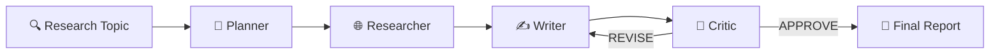

# Research & Content Validator

> **AI-Powered Multi-Agent Research Pipeline** — Automate research, generate professional reports with real-time web search, citation validation, and human-in-the-loop quality control.

[](https://www.python.org/)
[](LICENSE)
[](https://langchain-ai.github.io/langgraph/)
[](#quick-start)

---

## ✨ What's Inside



**One-liner:** Type a topic → Get a professionally sourced report in minutes.

---

## 🚀 Quick Start

### 1. Install

```bash
# Clone the repo
git clone https://github.com/thanhprty234/research-content-validator.git
cd research-content-validator

# Create virtual environment
python -m venv .venv
source .venv/bin/activate      # Linux/macOS
.venv\Scripts\activate         # Windows

# Install dependencies
pip install -r requirements.txt
```

### 2. Configure

```bash
# Copy environment template
cp .env.example .env

# Edit .env — set your model provider and API key
```

**Minimal config:**
```env
MODEL_PROVIDER=custom
MODEL_NAME=<your-model-name>
CUSTOM_API_KEY=sk-...
CUSTOM_BASE_URL=https://api.example.com/v1
```

### 3. Run

```bash
# CLI mode (text output)
python main.py --topic "How does RAG improve search relevance?"

# Web UI mode (browser interface)
python webui.py
# → Open http://localhost:5000
```

---

## 🎯 Key Features

| Feature | Description | Status |
|---------|-------------|--------|
| 🤖 **Multi-Agent Pipeline** | Planner → Researcher → Writer → Critic loop | ✅ |
| 🔗 **Web Search** | Tavily + DuckDuckGo fallback (no API key needed) | ✅ |
| 💰 **Cost Tracking** | Real-time token usage & budget guard | ✅ |
| 📊 **Citation Quality** | Auto-validates sources & links | ✅ |
| 🧪 **Human-in-the-Loop** | Manual review checkpoints with timeout | ✅ |
| 💾 **Checkpoint/Resume** | Save & resume interrupted runs | ✅ |
| 🌐 **Web UI** | Real-time SSE streaming dashboard | ✅ |
| 🐳 **Docker Support** | One-command deployment | ✅ |
| ⚡ **Rate Limiting** | Configurable delay between search requests | ✅ |

---

## 🏗️ Architecture

### Agent Flow

```
┌─────────────────────────────────────────────────────────────┐
│                    RESEARCH PIPELINE                        │
├──────────┬──────────┬──────────┬──────────┬───────────────┤
│ PLANNER  │RESEARCHER│  WRITER  │  CRITIC  │   END         │
├──────────┼──────────┼──────────┼──────────┼───────────────┤
│ Generates │ Searches │ Drafts   │ Evaluates│ Outputs final │
│ research  │ web      │ report   │ quality  │ report        │
│ plan      │ results  │          │ scores   │               │
└──────────┴──────────┴──────────┴──────────┴───────────────┘
                              │
              ┌───────────────┴───────────────┐
              │  REVISE loop (max 3 revisions) │
              └───────────────────────────────┘
```

### Data Flow

```
Input Topic
    │
    ▼
┌─────────┐     ┌─────────────┐     ┌─────────┐
│ Planner │────▶│ Researcher  │────▶│ Writer  │
│ (plan)  │     │ (web search)│     │ (draft) │
└─────────┘     └─────────────┘     └────┬────┘
                                         │
                                         ▼
                                    ┌─────────┐
                                    │  Critic │
                                    │ (score) │
                                    └────┬────┘
                                         │
                          ┌──────────────┼──────────────┐
                          │              │              │
                       APPROVE         REVISE        (loop back)
                          │              │
                          ▼              │
                     Final Report        │
                                          │
                                    ┌─────────┐
                                    │  Writer │ (revision)
                                    └─────────┘
```

---

## ⚙️ Configuration

### Environment Variables

| Variable | Example | Description |
|----------|---------|-------------|
| `MODEL_PROVIDER` | `custom` | LLM provider |
| `MODEL_NAME` | `<your-model>` | Model identifier |
| `CUSTOM_API_KEY` | `sk-***` | API key for custom provider |
| `CUSTOM_BASE_URL` | `https://api.example.com/v1` | API endpoint |
| `TAVILY_API_KEY` | `tvly-***` | Tavily search (optional) |
| `LANGCHAIN_TRACING_V2` | `true` | Enable LangSmith tracing |
| `BUDGET` | `5.0` | Max spend per run (USD) |
| `HUMAN_REVIEW` | `1` | Enable human review checkpoint |
| `HUMAN_REVIEW_TIMEOUT` | `5` | Timeout in minutes before auto-approve |
| `SEARCH_RATE_LIMIT_DELAY` | `0.5` | Delay between search requests (seconds) |

### Supported Providers

| Provider | Key Required | Base URL |
|----------|--------------|----------|
| `openai` | `OPENAI_API_KEY` | Auto |
| `anthropic` | `ANTHROPIC_API_KEY` | Auto |
| `gemini` | `GEMINI_API_KEY` | Auto |
| `ollama` | None | `http://localhost:11434` |
| `openrouter` | `OPENROUTER_API_KEY` | Auto |
| `deepseek` | `DEEPSEEK_API_KEY` | Auto |
| `groq` | `GROQ_API_KEY` | Auto |
| `together` | `TOGETHER_API_KEY` | Auto |
| `mistral` | `MISTRAL_API_KEY` | Auto |
| `opencode` | `OPENCODE_API_KEY` | Auto |
| `azure` | `AZURE_*` | Required |
| `custom` | `CUSTOM_*` | Required |

---

## 📋 CLI Reference

```bash
python main.py [OPTIONS]

--topic TEXT              Research topic (required)
--provider NAME           Override provider
--model NAME              Override model name
--stream                  Stream progress to terminal
--max-revisions N         Max revision attempts (default: 3)
--no-plan-cache           Disable plan caching
--thread-id TEXT          Checkpoint thread ID
--resume                  Resume from checkpoint
--budget FLOAT            Max cost in USD
--list-providers          Show available providers
--print-config            Print resolved config
```

**Examples:**

```bash
# Basic research
python main.py --topic "Impact of quantum computing on cryptography"

# With budget limit
python main.py --topic "AI regulation in 2024" --budget 2.0

# Resume interrupted run
python main.py --topic "Previous topic" --thread-id abc123 --resume

# Use specific model
python main.py --topic "Topic" --provider openai --model gpt-4o-mini

# Enable human review
HUMAN_REVIEW=1 python main.py --topic "Research topic"
```

---

## 🌐 Web UI

Start the web interface:

```bash
python webui.py
# → Open http://localhost:5000
```

**Features:**
- Real-time SSE progress streaming
- Provider & model selection dropdown
- Manual input for topic & parameters
- Live output panel with markdown rendering
- Pause/Resume workflow control
- Cost tracking dashboard

---

## 🐳 Docker

### Quick Start

```bash
# Build and run
docker-compose up -d

# Access UI at http://localhost:5000
# SearXNG search at http://localhost:8080
```

### Docker Compose Services

| Service | Port | Purpose |
|---------|------|---------|
| `app` | 5000 | Main web interface |
| `searxng` | 8080 | Search engine (optional) |

### Environment File

```bash
# Required for Docker
cp .env.example .env
# Edit .env with your API keys

docker-compose up -d
```

---

## 📄 Output Format

Reports are saved to `output/YYYYMMDD_HHMMSS_<topic_slug>/`:

```
output/
└── 20240827_232049_how-rag-improves-search/
    ├── report.md           # Final report with citations
    ├── verdict.json        # Full workflow snapshot
    └── cost_summary.json   # Token usage & cost breakdown
```

**Report structure:**
- Professional Markdown formatting
- Inline `[n]` citations linked to sources
- Structured sections from research plan
- Cost summary at the end

---

## 🧪 Testing

```bash
# Run all tests
python tests/test_agents.py
python tests/test_graph.py
python tests/test_hitl.py
python tests/test_cost.py
python tests/test_validation.py
python tests/test_registry.py
python tests/test_smoke.py

# All tests should pass (22/22)
```

---

## 📚 Project Structure

```
research-content-validator/
├── agents/
│   ├── planner.py        # Research plan generation
│   ├── researcher.py     # Parallel web search
│   ├── writer.py         # Report drafting
│   ├── critic.py         # Quality evaluation
│   ├── common.py         # LLM helpers (with rate limiting)
│   ├── schemas.py        # Pydantic models
│   ├── search.py         # Search orchestration
│   └── registry.py       # Agent registry (config)
├── tools/
│   ├── plan_cache.py     # Cache with 30-day TTL
│   ├── citation_check.py # URL & authority validation
│   └── search.py         # Cached search utility
├── evaluation/
│   ├── criteria.py       # Scoring rubric
│   └── evaluate.py       # Eval runner
├── models/
│   └── llm.py            # Multi-provider abstraction
├── tests/
│   ├── fakes.py          # FakeLLM for offline tests
│   └── test_*.py         # 7 test suites (22 tests)
├── main.py               # CLI entrypoint
├── webui.py              # Flask + SSE interface
├── graph.py              # LangGraph workflow
├── output.py             # Report export
├── config/agents.yaml    # Agent registry config
└── prompts/              # LLM prompt templates
```

---

## 📈 Roadmap

| Phase | Features | Status |
|-------|----------|--------|
| 0 | Core pipeline, multi-provider | ✅ Done |
| 1 | Cost tracking, budget guard | ✅ Done |
| 2 | Parallel research, citation quality | ✅ Done |
| 3 | Human review, scheduling | ✅ Done |
| 4 | Plugin system, extensibility | 📋 Planned |
| 5 | Production deployment | 📋 Planned |

**Future Enhancements (Optional):**
- Fact-checking agent (Phase 2.2)
- Multi-format export PDF/DOCX (Phase 3.2)
- RAG knowledge base extension (Phase 4.2)
- Supervisor agent (Phase 4.3)
- CI/CD pipeline (Phase 5.3)

---

## 🔒 Security

- API keys stored in `.env` (never commit)
- No hardcoded credentials
- Cost tracking prevents bill shock
- Checkpoint saves state safely
- Rate limiting prevents API abuse

---

## 🤝 Contributing

1. Fork the repository
2. Create a feature branch (`git checkout -b feature/AmazingFeature`)
3. Commit changes (`git commit -m 'Add AmazingFeature'`)
4. Push to branch (`git push origin feature/AmazingFeature`)
5. Open a Pull Request

---

## 📄 License

MIT License — See [LICENSE](LICENSE) for details.

---

## 🙏 Credits

- [LangGraph](https://langchain-ai.github.io/langgraph/) — Agent orchestration
- [DuckDuckGo](https://duckduckgo.com) — Free search fallback
- [SearXNG](https://searxng.github.io/) — Self-hosted search engine
- All LLM provider APIs

---

**Made with ❤️ by [thanhprty234](https://github.com/thanhprty234)**

---

## 📊 Project Status

| Metric | Value |
|--------|-------|
| **Score** | 90/100 |
| **Tests** | 22/22 PASSED |
| **Status** | PRODUCTION READY |
| **Last Update** | 2026-09-10 |
| **Commit** | `04b5028` |
